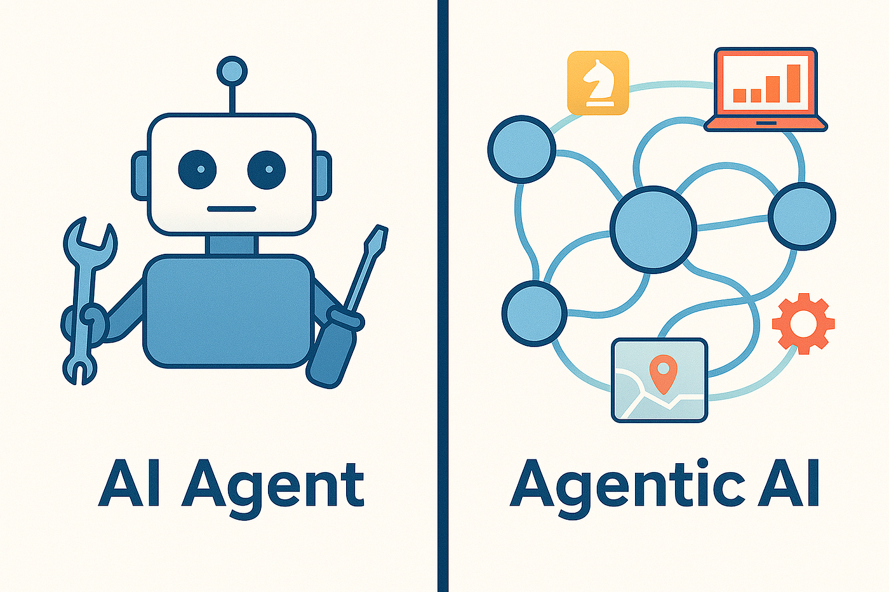

### Resources for AI Agents

AI systems: autonomous AI systems capable of perceiving their environment, invoking external tools,
managing memory, and executing multi-step plans toward completing complex tasks

#### Overview
* [Intro to Agents - Create an Agent from Scratch (No Frameworks)](https://www.youtube.com/watch?v=vHDwpoSFdQY)
* [How to build an agent : the emperor has no clothes](https://ampcode.com/how-to-build-an-agent)
* [Google]
  *  [Agents](https://drive.google.com/file/d/1W8EnoPXRLTQesfjvb-b3Zj-dnBf1f--n/view)
  *  [Agents Companion](https://drive.google.com/file/d/1GVPdwEh48bErTNdhxD0vqxPAifSx1I6Y/view)
* [Claude]
  * [Building Effective Agents](https://www.anthropic.com/engineering/building-effective-agents)
    * A good one to go through and look at its cookbok

#### Multi-agent
* [How we built our multi-agent research system](https://www.anthropic.com/engineering/multi-agent-research-system)
  * [youtbue video - Create an Open Deep Research Multi-Agent in Python (Step by Step)](https://www.youtube.com/watch?v=vHBRmXpDIFY)
  * [github repo](https://github.com/alejandro-ao/open-deep-research-w-firecrawl)
* Building Multi-Agent Systems blog
 * [part 1](https://blog.sshh.io/p/building-multi-agent-systems)
 * [part 2](https://blog.sshh.io/p/building-multi-agent-systems-part)
 * [part 3](https://blog.sshh.io/p/building-multi-agent-systems-part-c0c)

#### AI Agent Frameworks
* [LangGraph Notebooks](https://github.com/snehotosh/langgraph-notebooks)
* [MiroThinker is MiroMind's Flagship Research Agent Model](https://github.com/MiroMindAI/MiroThinker)
* [Anthropic - Agent SDK](https://platform.claude.com/docs/en/agent-sdk/overview)
* [Pydantic AI](https://github.com/pydantic/pydantic-ai)
* [Google ADK](https://google.github.io/adk-docs/)
  * [Google ADK: The One Tool That’s Making AI Agent Development Ridiculously Easy](https://medium.com/google-cloud/google-adk-the-one-tool-thats-making-ai-agent-development-ridiculously-easy-746e1da2b8d6)
* [OpenAI Agents SDK](https://openai.github.io/openai-agents-python/)

#### AI Agent Evaluation
* [Demystifying evals for AI agents](https://www.anthropic.com/engineering/demystifying-evals-for-ai-agents)
* [Building Agents and Eval Harnesses with Local LLMs with Ravin Kumar (Google DeepMind)](https://www.youtube.com/watch?v=Hhwi-2vWMPA)
* [AI Evals for Everyone - free course](https://github.com/aishwaryanr/awesome-generative-ai-guide/tree/main/free_courses/ai_evals_for_everyone)

#### AI Agent Use Cases
* [100+ Use Cases For The Enterprise - Moveworks](./100-real-world-ai-agent-use-cases-for-the-enterprise.pdf)
* [Deep Agents Overview](https://blog.langchain.com/deep-agents/)
  * Can plan and act over longer, more complex tasks
  * [Implementing deepagents: a technical walkthrough](https://www.youtube.com/watch?v=TTMYJAw5tiA)
* [Open Deep Research Application](https://github.com/langchain-ai/open_deep_research?tab=readme-ov-file)
  * Deep research has broken out as one of the most popular agent applications
* [Anthropic - How we built our multi-agent research system](https://www.anthropic.com/engineering/multi-agent-research-system)
* Claude Code
  * [How Claude Code is built](https://newsletter.pragmaticengineer.com/p/how-claude-code-is-built)
  * [Things We Can Learn from Claude Code](https://kotrotsos.medium.com/things-we-can-learn-from-claude-code-67e10daa3976)
  * [How Claude Code Works - youtube](https://www.youtube.com/watch?v=RFKCzGlAU6Q)
  * [Claude Code Architecture](https://vrungta.substack.com/p/claude-code-architecture-reverse)
  * [Inside Claude Code: The Architecture of an Autonomous Agent](https://github.com/vkr11/ChainOfThought/blob/main/claude_code_architecture.md)
* [DeepTutor: AI-Powered Personalized Learning Assistant](https://github.com/HKUDS/DeepTutor)
* [AI Sales Use Case - Cerebras](https://www.youtube.com/watch?v=mwzk2rlwtZE)
* [Anthropic: How we built our multi-agent research system](https://www.anthropic.com/engineering/multi-agent-research-system)
* [Ramp: Why We Built Our Own Background Agent](https://builders.ramp.com/post/why-we-built-our-background-agent)
  * Try to recreate this agent  
* [Dexter: an autonomous financial research agent ](https://github.com/virattt/dexter)
* [Open Source Cowork Desktop to Unlock Your Exceptional Productivity - multi-agent system](https://github.com/eigent-ai/eigent)
* [OpenCode: Open Source Coding Agent](https://opencode.ai/)
  * [Its github repo](https://github.com/anomalyco/opencode)
* [Mistral's open-source CLI coding assistant](https://github.com/mistralai/mistral-vibe)
* [OpenAI Codex CLI github](https://github.com/openai/codex)
  * [Blog - Unrolling the Codex agent loop](https://openai.com/index/unrolling-the-codex-agent-loop/)
  * [Blog - Unlocking the Codex harness](https://openai.com/index/unlocking-the-codex-harness/)
  * [Blog - Harness engineering: leveraging Codex in an agent-first world](https://openai.com/index/harness-engineering/)
  * Should study this
* Personal AI assistant
  * [OpenClaw](https://github.com/openclaw/openclaw)
  * [nanobot - Ultra-Lightweight Personal AI Assistant](https://github.com/patchy631/nanobot)
* [What we learned building agents at Vercel](https://vercel.com/blog/what-we-learned-building-agents-at-vercel)

 
#### Context Engineering & System Prompt
* Context engineering is the delicate art and science of filling the context window with just the right information for the next step - Andrej Karpathy
* [Context Engineering for Agents by Lance Martin](https://rlancemartin.github.io/2025/06/23/context_engineering/)
  * [Context Engineering for Agents - Lance Martin, LangChain ](https://www.youtube.com/watch?v=_IlTcWciEC4)
* [Claude Code System Prompt](https://github.com/kn1026/cc/blob/main/claudecode.md)
* Context Engineering for AI Agents - lessons from building Manus
  * [slides](https://drive.google.com/file/d/1QGJ-BrdiTGslS71sYH4OJoidsry3Ps9g/view?pli=1), [slides by Lance](https://docs.google.com/presentation/d/1Z-TFQpSpqtRqWcY-rBpf7D3vmI0rnMhbhbfv01duUrk/edit?slide=id.g38aedf7fc8c_0_0#slide=id.g38aedf7fc8c_0_0)
  * [youtube video](https://www.youtube.com/watch?v=6_BcCthVvb8)
  * [blog - Context Engineering for AI Agents: Lessons from Building Manus](https://manus.im/blog/Context-Engineering-for-AI-Agents-Lessons-from-Building-Manus)
* [Context Engineering in Manus](https://rlancemartin.github.io/2025/10/15/manus/)
* [Architecting efficient context-aware multi-agent framework for production](https://developers.googleblog.com/architecting-efficient-context-aware-multi-agent-framework-for-production/)
* [Context Engineering: Sessions, Memory](https://drive.google.com/file/d/1JW6Q_wwvBjMz9xzOtTldFfPiF7BrdEeQ/view)
* [Anthropic: Effective context engineering for AI agents](https://www.anthropic.com/engineering/effective-context-engineering-for-ai-agents)
* [Context Engineering Our Way to Long-Horizon Agents: LangChain CEO](https://www.youtube.com/watch?v=vtugjs2chdA)

#### Course & Tutorials
* [Kaggle - 5-Day AI Agents Intensive Course with Google](https://www.kaggle.com/learn-guide/5-day-agents)
  * [Agents Intensive - Capstone Project](https://www.kaggle.com/competitions/agents-intensive-capstone-project/discussion/663531)
* [Microsoft - AI Agents for Beginners course](https://github.com/microsoft/ai-agents-for-beginners)
* [Agentic AI Crash Course by Aishwarya](https://github.com/aishwaryanr/awesome-generative-ai-guide/tree/main/free_courses/agentic_ai_crash_course)
* [AI-Tutorial-Codes-Included](https://github.com/Marktechpost/AI-Tutorial-Codes-Included)
* [Project: Deep Research with LangGraph course](https://academy.langchain.com/courses/deep-research-with-langgraph)
* [LangChain Academy](https://academy.langchain.com)
* [Anthropic Academy](https://anthropic.skilljar.com/)
* Google ADK
  * [Getting started with Agent Developer Kit playlist](https://www.youtube.com/playlist?list=PLOU2XLYxmsIIAPgM8FmtEcFTXLLzmh4DK)
  * [ADK - Conceptual Overview](https://www.youtube.com/watch?v=CFOBf3vMF_8)
  * [ADK documentation](https://google.github.io/adk-docs)
  * [The Agent Factor podcast playlist](https://www.youtube.com/playlist?list=PLIivdWyY5sqLXR1eSkiM5bE6pFlXC-OSs)
* DeepLearning.AI
  * [Agentic AI by Andrew Ng](https://learn.deeplearning.ai/courses/agentic-ai)
  * [Agentic Coding Assistant by Anthropic](https://www.deeplearning.ai/short-courses/claude-code-a-highly-agentic-coding-assistant/)
  * [Nvidia NeMo Agent Toolkit](https://www.deeplearning.ai/short-courses/nvidia-nat-making-agents-reliable/)

#### AI Agents Evaluation
* [LangSmith](https://www.langchain.com/langsmith/observability)
* [Opik](https://www.comet.com/site/products/opik)
* [Maxim](https://www.getmaxim.ai/docs/introduction/overview)
* [Arize Phoenix](https://phoenix.arize.com/)
* [Helicone](https://www.honeycomb.io)
* [LangFuse](https://langfuse.com/)
* [The Best AI Observability Tools in 2025]
  * [Maxim AI, LangSmith, Arize, Helicone, and Comet Opik](https://www.getmaxim.ai/articles/the-best-ai-observability-tools-in-2025-maxim-ai-langsmith-arize-helicone-and-comet-opik/)
  * [Comet - Best LLM Observability Tools of 2025](https://www.comet.com/site/blog/llm-observability-tools/)

#### Agent Ops
* 

#### Papers & Blogs & Book
* [Adaptation of Agentic AI](https://arxiv.org/pdf/2512.16301)
* [Memory in the Age of AI Agents: A Survey](https://arxiv.org/pdf/2512.13564)
* [Agentic Reasoning for Large Language Models - must read](https://arxiv.org/pdf/2601.12538)
* [When Agents Actually Work](https://tmlsinsights.substack.com/p/when-to-build-agents-vs-prompt-engineering)
* [7 Sources to Master Agents and Agentic Reasoning](https://www.turingpost.com/p/7-sources-to-master-agents-and-agentic-reasoning)
* [Agentic Design Book](https://github.com/sarwarbeing-ai/Agentic_Design_Patterns/tree/main)
* DeepLeaning.AI Agentic Design series
  * [Agentic Design Patterns Part 1](https://www.deeplearning.ai/the-batch/how-agents-can-improve-llm-performance/)
  * [Agentic Design Patterns Part 2, Reflection](https://www.deeplearning.ai/the-batch/agentic-design-patterns-part-2-reflection/)
  * [Agentic Design Patterns Part 3, Tool Use](https://www.deeplearning.ai/the-batch/agentic-design-patterns-part-3-tool-use/)
  * [Agentic Design Patterns Part 4, Planning](https://www.deeplearning.ai/the-batch/agentic-design-patterns-part-4-planning/)
  * [Agentic Design Patterns Part 5, Multi-Agent Collaboration](https://www.deeplearning.ai/the-batch/agentic-design-patterns-part-5-multi-agent-collaboration)

#### Terminology
* Workflows: systems where LLMs and tools are orchestrated through predefined code paths
* Agent: refers to an entity that can act on behalf of another
* Agents: systems where LLMs dynamically direct their own processes and tool usage, maintaining control over how they accomplish tasks
* Agency: the ability to make decisions, undertake tasks, and act for someone or something
* Agents have agency. They dynamically decide which tools to use and how many steps to take. The number of steps isn't predetermined, each outcome shapes what comes next.
